# Súper CLABE — Documentación Técnica y Operativa Completa

| Campo | Valor |
|-------|--------|
| **Sistema** | Súper CLABE — Webapp de Cobros y Pagos SPEI / CoDi |
| **Modelo** | PSPI · capa no-custodia · sin captación de fondos |
| **Versión del documento** | 2.0 |
| **Fecha** | Agosto 2026 |
| **Clasificación** | Confidencial — uso interno |
| **Código fuente** | `webapp-spei-codi/` |
| **Documento previo** | `docs/DOCUMENTACION-TECNICA.md` (v1.0, parcialmente desactualizado) |

---

## Índice

1. [Resumen ejecutivo](#1-resumen-ejecutivo)
2. [Modelo regulatorio y de negocio](#2-modelo-regulatorio-y-de-negocio)
3. [Principio de no-custodia (puente CoDi)](#3-principio-de-no-custodia-puente-codi)
4. [Arquitectura del sistema](#4-arquitectura-del-sistema)
5. [Stack tecnológico](#5-stack-tecnológico)
6. [Módulos funcionales](#6-módulos-funcionales)
7. [Modelo de datos](#7-modelo-de-datos)
8. [API REST completa](#8-api-rest-completa)
9. [Flujos operativos (flujogramas)](#9-flujos-operativos-flujogramas)
10. [Tarifas, membresía e IVA](#10-tarifas-membresía-e-iva)
11. [Perfil Financiero y límites KYC](#11-perfil-financiero-y-límites-kyc)
12. [Seguridad y controles](#12-seguridad-y-controles)
13. [Frontend y experiencia de usuario](#13-frontend-y-experiencia-de-usuario)
14. [Notificaciones y favoritos](#14-notificaciones-y-favoritos)
15. [Auditoría y cumplimiento](#15-auditoría-y-cumplimiento)
16. [Despliegue y operación](#16-despliegue-y-operación)
17. [Datos demo y pruebas](#17-datos-demo-y-pruebas)
18. [Estado actual vs producción Banxico](#18-estado-actual-vs-producción-banxico)
19. [Glosario](#19-glosario)
20. [Referencias normativas](#20-referencias-normativas)

---

## 1. Resumen ejecutivo

**Súper CLABE** es una plataforma web fullstack de cobranza y pagos que opera como **capa de software no-custodia** sobre los rieles del Banco de México (**SPEI**, **CoDi** y **Dimo**).

El dinero **nunca entra** a una cuenta de la plataforma: viaja **cuenta bancaria del pagador → cuenta bancaria del cobrador**. Súper CLABE actúa como **puente / iniciador de pagos** (figura PSPI): genera el Mensaje de Cobro, orquesta la UX, aplica controles de perfil financiero y registra la liquidación.

La monetización es una **membresía prepago** de software: se debita **0.05% + I.V.A. 16%** del saldo de membresía del receptor al liquidar una operación. No hay wallet de fondos de clientes ni captación (evita clasificación como IFPE).

### Capacidades principales

| Capacidad | Descripción |
|-----------|-------------|
| Registro / login por alias `$@…` | Identidad única en la plataforma |
| Perfil Financiero (KYC 1–4) | Topes mensuales de abonos recibidos |
| Mis cuentas (bóveda) | CLABE destino cifrada AES-256 |
| Cobrar (CoDi) | QR / folio con monto fijo o libre, abierto o dirigido |
| Pagar | Inbox, lector QR, pago directo P2P |
| Favoritos | Contactos frecuentes para cobrar/pagar |
| Membresía | Recarga, simulador de tarifa, bloqueo por saldo |
| Notificaciones in-app | Eventos de cobro, pago, bóveda, KYC |
| Bitácora inmutable | Hash SHA-256 encadenado |

---

## 2. Modelo regulatorio y de negocio

### 2.1 Figura y marco

| Aspecto | Definición |
|---------|------------|
| Figura | **PSPI** (Proveedor de Servicios de Participación Indirecta) / iniciador de pagos, patrocinado por un participante SPEI directo (banco o IFPE) |
| Marco | Circular 14/2017 (SPEI), Circular 12/2019 (CoDi), Ley Fintech, LTOSF, homologación UX Circular 9/2026 |
| Custodia | **Sin captación**: no depósitos, no wallets de cliente, no crédito |
| Monetización | Membresía prepago; tarifa software 0.05% + IVA; no comisión interbancaria al receptor CoDi |
| Bloqueo operativo | Membresía en `blocked` → no genera/procesa operaciones hasta recargar |

### 2.2 Mapa de reglas aplicadas en el sistema

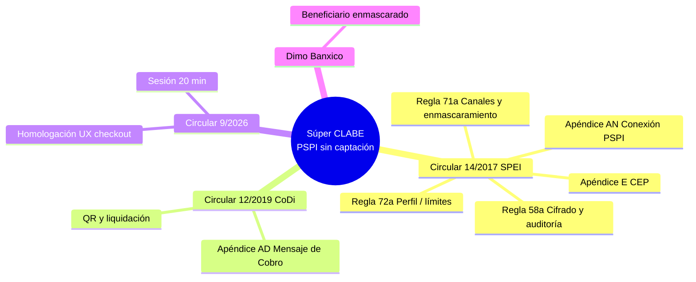

| Regla / circular | Implementación en Súper CLABE |
|------------------|-------------------------------|
| **Regla 58a** | Bóveda AES-256, bitácora hash encadenada, retención ≥6 meses SPEI / 1 año canales |
| **Regla 71a** | JWT 20 min, TOTP opcional, CLABE/nombre enmascarados en checkout |
| **Regla 72a** | Niveles KYC 1–4; tope de **abonos** mensuales del receptor |
| **Apéndice AD** | Generación de cobro + `qr_payload` tipo `CODI_CHARGE` |
| **Apéndice E** | Vínculo a CEP Banxico por folio/clave |
| **Manual SPEI §6** | Validación CLABE dígito verificador mod-10 |

### 2.3 Qué es y qué no es la plataforma

| Es | No es |
|----|-------|
| Orquestador de cobros/pagos CoDi | Banco ni IFPE |
| Almacén cifrado de CLABE **destino** | Wallet con saldo de clientes |
| Capa UX + cumplimiento + auditoría | Participante SPEI directo (requiere patrocinio) |
| Cobro de licencia de software (membresía) | Captador de fondos del público |

---

## 3. Principio de no-custodia (puente CoDi)

### 3.1 Idea central

Súper CLABE **solo arma el mensaje y la experiencia**. La liquidación real (en producción) la ejecutan los bancos del pagador y del beneficiario a través de Banxico.

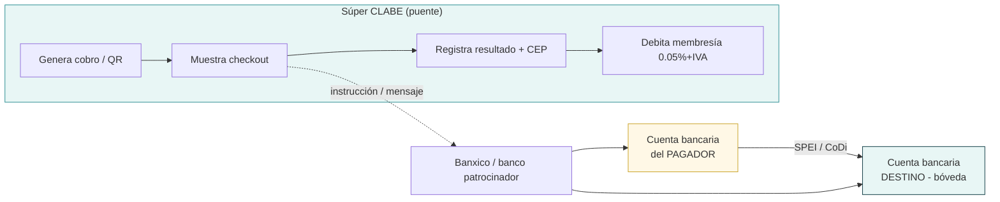

### 3.2 Rol de “Mis cuentas”

| Pregunta | Respuesta |
|----------|-----------|
| ¿Para cobrar? | **Sí** — CLABE destino del cobro |
| ¿Para pagar (cuenta origen)? | **No** — el cargo lo autoriza el banco del pagador |
| ¿Por qué? | En CoDi el origen vive en la app bancaria del pagador; la PSPI no custodia ni debita esa cuenta |

### 3.3 Flujo lógico del puente

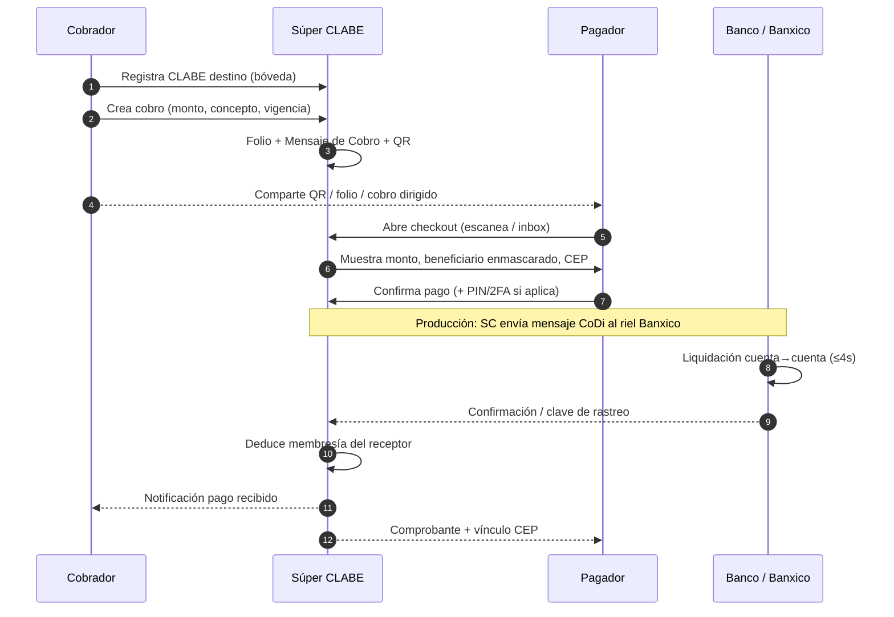

> **Hoy en el código:** `POST /checkout/{folio}/pay` y `POST /checkout/direct` **simulan** la liquidación (generan clave de rastreo y CEP). La conexión real PSPI ↔ Banxico es el siguiente hito de producción.

---

## 4. Arquitectura del sistema

### 4.1 Vista de componentes

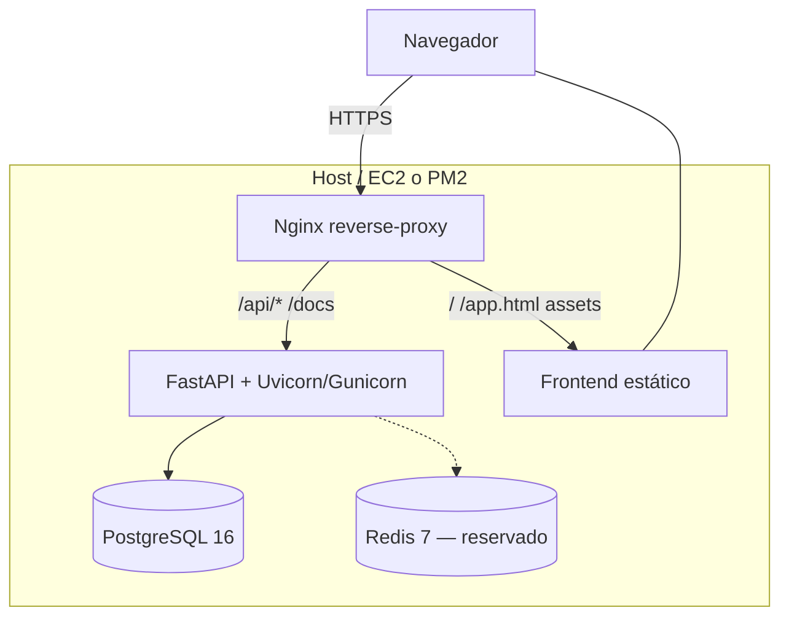

### 4.2 Estructura del repositorio

```
webapp-spei-codi/
├── backend/                 # FastAPI, ORM, routers, migraciones
│   ├── app/
│   │   ├── main.py          # Entrada, seed demo, static mount
│   │   ├── config.py        # Env + constantes de negocio
│   │   ├── models.py        # Tablas ORM
│   │   ├── schemas.py       # Contratos Pydantic
│   │   ├── crypto.py        # AES, CLABE, PIN, hashes
│   │   ├── security.py      # JWT + TOTP
│   │   ├── fees.py          # 0.05% + IVA
│   │   ├── kyc_limits.py    # Topes abonos Regla 72a
│   │   ├── audit.py         # Bitácora encadenada
│   │   ├── notify.py        # Notificaciones in-app
│   │   └── routers/         # auth, kyc, vault, billing,
│   │                        # checkout, membership,
│   │                        # notifications, compliance
│   ├── migrations/          # SQL incrementales
│   └── init.sql
├── frontend/
│   ├── index.html           # Landing marketing
│   ├── app.html             # SPA del sistema
│   ├── config.js            # API_BASE, USE_API
│   └── assets/              # Logo, demos
├── docs/                    # Esta documentación
├── deploy/                  # Guía AWS EC2
├── nginx/                   # Proxy producción
├── docker-compose*.yml
└── ecosystem.config.js      # PM2 puerto 3017 (dev)
```

### 4.3 Estilo arquitectónico

- **Backend en capas:** router HTTP → esquema Pydantic → servicio/ORM → utilidades (crypto, fees, audit, notify).
- **Frontend SPA sin build:** un `app.html` con secciones `v-*` conmutadas por JS; consume `/api/v1`.
- **Misma origen:** Nginx (o FastAPI StaticFiles) sirve UI + API.

---

## 5. Stack tecnológico

### 5.1 Backend

| Tecnología | Rol |
|------------|-----|
| Python 3.12+ | Runtime |
| FastAPI | API REST + OpenAPI/Swagger |
| Uvicorn / Gunicorn | ASGI (dev / prod) |
| SQLAlchemy 2 | ORM |
| Pydantic 2 | Validación I/O |
| PostgreSQL 16 | Persistencia (SQLite fallback) |
| python-jose | JWT HS256 |
| cryptography | AES-256-CBC |

### 5.2 Frontend

| Tecnología | Rol |
|------------|-----|
| HTML5 / CSS3 / JS ES2020 | SPA sin framework |
| qrcodejs | QR de cobro |
| jsQR | Lectura QR (cámara / imagen) |
| localStorage | Solo token JWT (`superclabe_token`) |

### 5.3 Constantes de negocio (código)

```
MEMBERSHIP_FEE_RATE     = 0.0005      # 0.05%
IVA_RATE                = 0.16        # 16%
MAX_WHATSAPP_REMINDERS  = 3
SESSION_TIMEOUT_MIN     = 20          # Circular 9/2026
JWT_EXPIRE_MIN          = 20
KYC_LIMITS_UDIS         = {1:0, 2:3000, 3:8000, 4:None}
KYC_MONTHLY_LIMITS_MXN  = {1:0, 2:25000, 3:68000, 4:None}
MIN_OPERATING_LEVEL     = 2
CEP_BASE                = https://www.banxico.org.mx/cep/check?folio=
```

---

## 6. Módulos funcionales

El sistema expone **8 vistas** de producto (más auth y notificaciones).

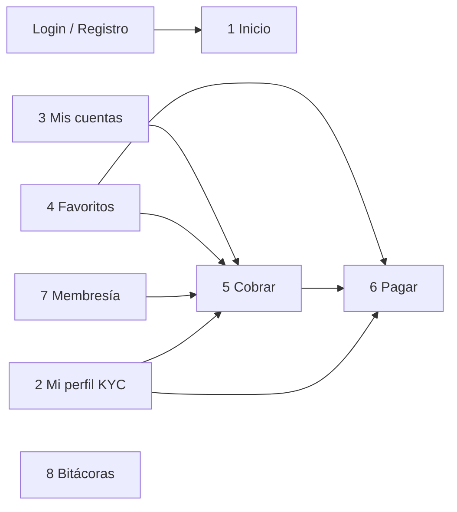

### 6.1 Catálogo de módulos

| # | Módulo UI | Backend | Función | Norma |
|---|-----------|---------|---------|-------|
| 1 | **Inicio** | transactions, membership, me | KPIs, últimos movimientos, tarjeta membresía | Operativo |
| 2 | **Mi perfil** | `/kyc`, `/auth/me` | KYC gradual 1–4; topes de abonos | Regla 72a |
| 3 | **Mis cuentas** | `/vault` | CLABE destino cifrada | Regla 58a |
| 4 | **Favoritos** | `/billing/favorites` | Contactos para cobro dirigido / pago directo | UX |
| 5 | **Cobrar** | `/billing/charges` | Mensaje de Cobro CoDi + QR | Apéndice AD |
| 6 | **Pagar** | `/checkout` | Inbox, QR, pago directo | Regla 71a |
| 7 | **Membresía** | `/membership` | Saldo prepago, recarga, simulador | LTOSF / no IFPE |
| 8 | **Bitácoras** | `/compliance` | Auditoría + verificación de cadena | Regla 58a |

### 6.2 Funciones por módulo (detalle operativo)

#### Inicio (Dashboard)
- Resumen de volumen cobrado / enviado.
- Tarjeta de membresía: saldo MXN, % usado, volumen estimado de operaciones.
- Listado filtrable y paginado de transacciones.
- Accesos rápidos a cuentas, perfil y membresía.

#### Mi perfil (Perfil Financiero)
- Tipo: persona física o moral.
- Elevación de nivel con CURP/RFC y documentos (rutas almacenadas).
- Visualización de uso mensual de **abonos recibidos**.
- Nivel 1 no puede operar.

#### Mis cuentas (Bóveda)
- Alta de CLABE con validación mod-10.
- Alias amigable, titular, banco.
- Solo se muestra CLABE enmascarada (`••••7890`).
- Obligatoria para crear cobros (cuenta destino).

#### Favoritos
- Buscar usuarios por alias / nombre.
- Agregar / quitar favoritos.
- Atajos a cobro dirigido y pago directo.

#### Cobrar
- Asistente en pasos: cuenta destino → monto → opciones → QR.
- Tipos: **OPEN** (cualquiera) / **TARGETED** (alias destino).
- Monto fijo u **open amount** (el pagador decide).
- Usos máximos, frecuencia, vigencia, PIN opcional.
- Mis cobros: estado, recordatorios (máx. 3), QR.

#### Pagar
- **Inbox:** cobros dirigidos al usuario.
- **QR:** cámara, imagen o pegar payload/folio.
- **Envío directo:** a alias (sin QR).
- Checkout con beneficiario enmascarado y vínculo CEP.

#### Membresía
- Consulta de saldo y estatus (`active` / `blocked`).
- Recarga simulada.
- Simulador: monto → tarifa + IVA = total.

#### Bitácoras
- Tabla de eventos.
- Botón verificar integridad de la cadena hash.

---

## 7. Modelo de datos

### 7.1 Diagrama entidad-relación (lógico)

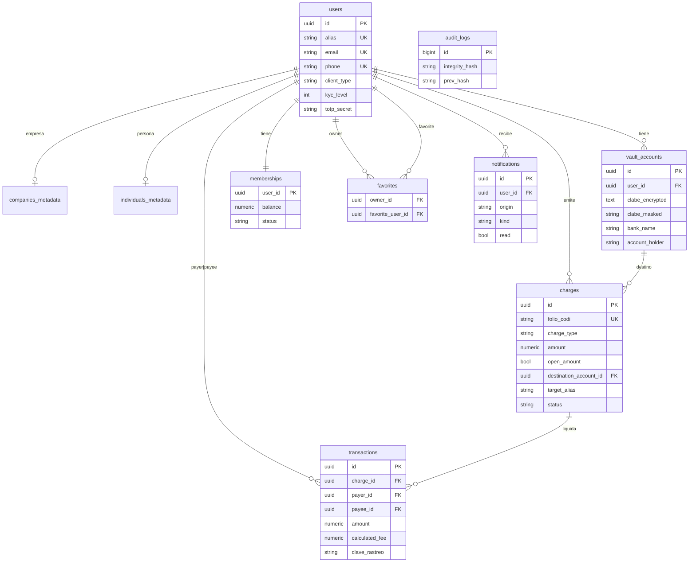

### 7.2 Tablas

| Tabla | Propósito |
|-------|-----------|
| `users` | Identidad `$@alias`, email/teléfono, KYC, TOTP |
| `companies_metadata` / `individuals_metadata` | Datos de identidad cifrados + docs |
| `vault_accounts` | CLABE destino cifrada / máscara / hash |
| `memberships` | Saldo prepago y estatus |
| `charges` | Cobros CoDi (OPEN/TARGETED, usos, frecuencia, PIN) |
| `favorites` | Relación usuario→usuario favorito |
| `transactions` | Liquidaciones; `charge_id` null = pago directo |
| `audit_logs` | Eventos con hash encadenado |
| `notifications` | Alertas in-app por origen |

Migraciones: `backend/migrations/001_*.sql` … `003_*.sql`.

---

## 8. API REST completa

**Base:** `/api/v1`  
**Auth:** `Authorization: Bearer <JWT>` salvo endpoints públicos.  
**Swagger:** `/docs`

### 8.1 Mapa de routers

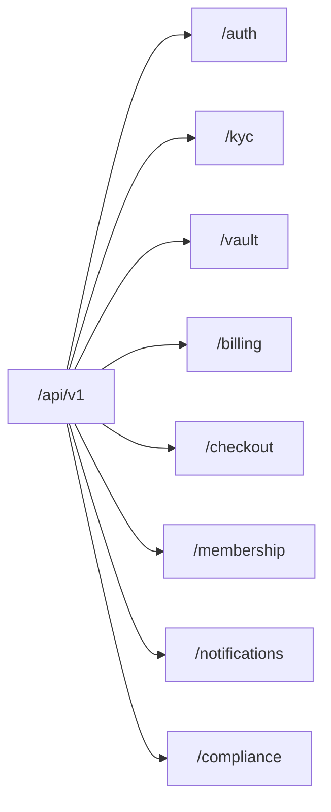

### 8.2 Endpoints

#### Salud
| Método | Ruta | Auth | Descripción |
|--------|------|------|-------------|
| GET | `/api/health` | No | Healthcheck |

#### Auth
| Método | Ruta | Auth | Descripción |
|--------|------|------|-------------|
| POST | `/auth/register` | No | Alta usuario + membresía 0 + KYC 1 |
| POST | `/auth/login` | No | Login por alias; TOTP opcional → JWT |
| GET | `/auth/me` | Sí | Perfil + uso mensual KYC |
| GET | `/auth/lookup?alias=` | No | Lookup público para UX login |
| GET | `/auth/users` | Sí | Directorio (favoritos / dirigidos) |

#### KYC
| Método | Ruta | Auth | Descripción |
|--------|------|------|-------------|
| GET | `/kyc/limits` | No | Límites en UDIS |
| POST | `/kyc/upgrade` | Sí | Eleva nivel 2–4 |

#### Vault
| Método | Ruta | Auth | Descripción |
|--------|------|------|-------------|
| POST | `/vault/accounts` | Sí | Alta CLABE cifrada |
| GET | `/vault/accounts` | Sí | Listado enmascarado |

#### Billing
| Método | Ruta | Auth | Descripción |
|--------|------|------|-------------|
| POST | `/billing/charges` | Sí | Crea cobro + QR |
| GET | `/billing/charges` | Sí | Mis cobros |
| GET | `/billing/charges/payable` | Sí | Cobros dirigidos a mí |
| POST | `/billing/charges/{id}/remind` | Sí | Recordatorio (máx. 3) |
| GET | `/billing/users/search` | Sí | Buscar usuarios |
| GET/POST/DELETE | `/billing/favorites[/{alias}]` | Sí | CRUD favoritos |

#### Checkout
| Método | Ruta | Auth | Descripción |
|--------|------|------|-------------|
| POST | `/checkout/direct` | Sí | Pago P2P sin QR |
| POST | `/checkout/scan` | No | Decodifica QR → checkout |
| GET | `/checkout/{folio}` | No | Vista pública del cobro |
| POST | `/checkout/{folio}/pay` | No* | Liquidación simulada |

\*Requiere `payer_alias` coherente en cobros TARGETED.

#### Membership
| Método | Ruta | Auth | Descripción |
|--------|------|------|-------------|
| GET | `/membership` | Sí | Saldo, status, tasas |
| POST | `/membership/recharge` | Sí | Recarga (simulada) |
| POST | `/membership/deduct` | Sí | Deducción manual / interna |

#### Notifications
| Método | Ruta | Auth | Descripción |
|--------|------|------|-------------|
| GET | `/notifications` | Sí | Listado |
| GET | `/notifications/unread-count` | Sí | Contador |
| POST | `/notifications/{id}/read` | Sí | Marcar leída |
| POST | `/notifications/read-all` | Sí | Marcar todas |

#### Compliance
| Método | Ruta | Auth | Descripción |
|--------|------|------|-------------|
| GET | `/compliance/audit-logs` | Sí | Bitácora |
| GET | `/compliance/audit-logs/verify` | Sí | Verifica cadena |
| GET | `/compliance/transactions` | Sí | Tx + CEP |
| GET | `/compliance/reconciliation` | Sí | Conciliación receptor |

---

## 9. Flujos operativos (flujogramas)

### 9.1 Alta de usuario y primer uso

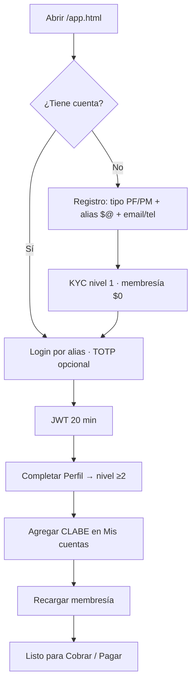

### 9.2 Crear cobro CoDi

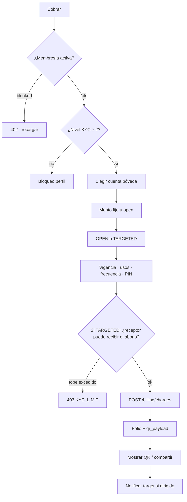

### 9.3 Pagar un cobro (QR / inbox)

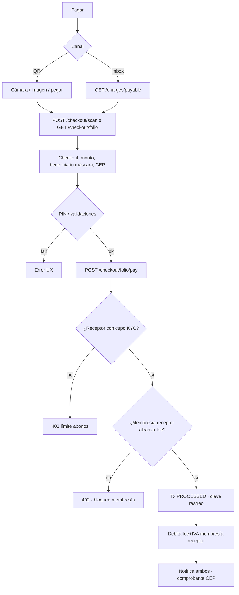

### 9.4 Pago directo (sin QR)

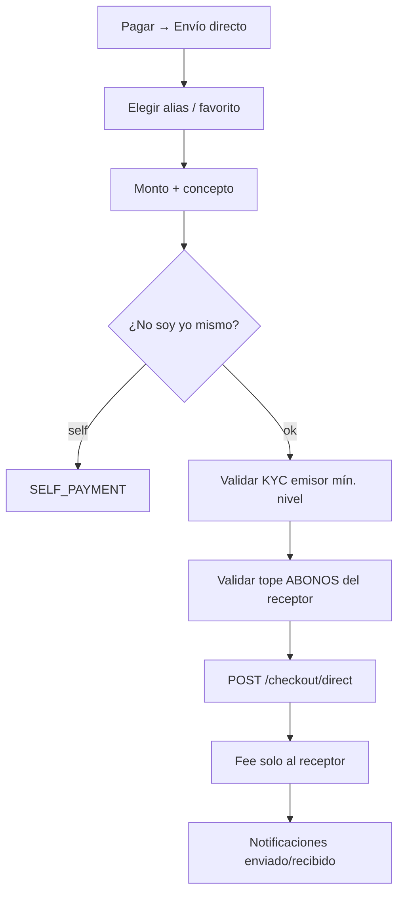

### 9.5 Ciclo de membresía

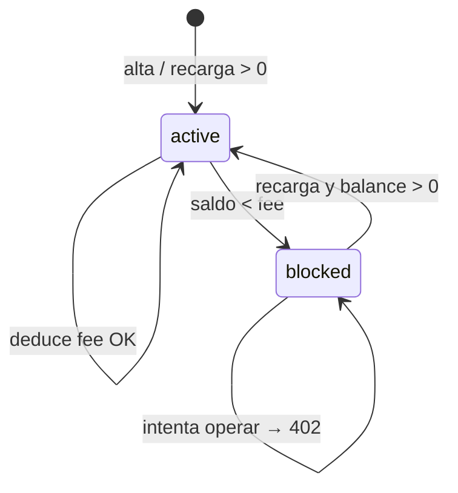

### 9.6 Matriz de roles en una operación

| Operación | Quién inicia en app | Cuenta origen bancaria | Cuenta destino | Fee membresía | Tope KYC que aplica |
|-----------|---------------------|------------------------|----------------|---------------|---------------------|
| Cobro QR OPEN | Cobrador | Banco del pagador | Bóveda cobrador | Receptor (cobrador) | Abonos del cobrador |
| Cobro TARGETED | Cobrador | Banco del pagador | Bóveda cobrador | Receptor | Abonos del cobrador (+ validación al crear) |
| Pago directo | Pagador | Banco del pagador* | Cuenta asociada al receptor* | Receptor | Abonos del receptor |

\*En simulación actual no se selecciona CLABE origen/destino en pago directo; en producción CoDi/SPEI el destino debe resolverse a la bóveda/CLABE del receptor.

---

## 10. Tarifas, membresía e IVA

### 10.1 Fórmula

```
base_fee  = redondeo_2( monto × 0.0005 )
iva       = redondeo_2( base_fee × 0.16 )
total_fee = redondeo_2( base_fee + iva )
```

**Ejemplo:** monto $10,000.00 MXN  
→ base $5.00 + IVA $0.80 = **$5.80 MXN** debitados de la membresía del receptor.

### 10.2 Quién paga la tarifa de software

| Flujo | Pagador del fee |
|-------|-----------------|
| Liquidar cobro QR/CoDi | **Dueño del cobro** (receptor) |
| Pago directo | **Receptor** (cobro no solicitado) |
| Emisor / quien envía | **$0** de membresía por la transferencia |

### 10.3 Volumen estimado en dashboard

Con saldo de membresía `S`:

```
volumen_operaciones ≈ S / (0.0005 × 1.16) = S / 0.00058
```

Se muestra en MXN, nunca negativo.

---

## 11. Perfil Financiero y límites KYC

### 11.1 Niveles

| Nivel | Operación | Tope mensual de **abonos recibidos** |
|-------|-----------|--------------------------------------|
| 1 | Solo registro | $0 (bloqueado) |
| 2 | Opera | $25,000 MXN |
| 3 | Opera | $68,000 MXN |
| 4 | Opera | Sin límite mensual |

> El tope **no** suma envíos/cargos; solo créditos donde el usuario es `payee`.

### 11.2 Dónde se valida

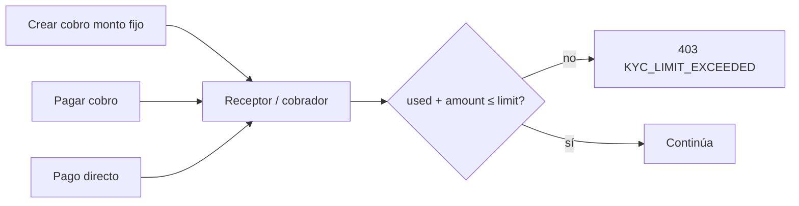

Códigos: `KYC_LEVEL_BLOCKED`, `KYC_LIMIT_EXCEEDED`.  
UI: modal `#kycLimitModal` + mensajes amigables.

---

## 12. Seguridad y controles

| Control | Detalle |
|---------|---------|
| JWT | HS256, expiración 20 min |
| TOTP | Opcional en login (RFC 6238) |
| AES-256-CBC | CLABE, CURP, RFC, nombres sensibles |
| CLABE | Mod-10; máscara últimos 4; hash SHA-256 para unicidad |
| PIN de cobro | PBKDF2-HMAC-SHA256 (200k iteraciones) |
| Enmascaramiento checkout | Titular por iniciales; banco visible; sin CLABE completa |
| CORS | `*` en desarrollo (restringir en prod) |
| Secretos | `AES_SECRET_KEY`, `JWT_SECRET` por entorno |

**Nota:** el login actual es por **alias sin contraseña** (modo demo/desarrollo). En producción debe reforzarse (password y/o 2FA obligatorio).

---

## 13. Frontend y experiencia de usuario

### 13.1 Superficies

| Archivo | Rol |
|---------|-----|
| `frontend/index.html` | Landing marketing + demo |
| `frontend/app.html` | Sistema completo (login + 8 módulos) |
| `frontend/config.js` | `API_BASE: "/api/v1"`, `USE_API: true` |

### 13.2 Identidad visual

| Token | Hex |
|-------|-----|
| Deep | `#0E3B43` |
| Brand | `#2A8D92` |
| Accent | `#64C4BC` |

### 13.3 Navegación y estados

- Sidebar con módulos + bloque de cumplimiento (circulars / PSPI).
- Topbar: alias, nivel KYC, saldo membresía, favoritos ★, campana de notificaciones.
- Lenguaje UX amigable en español (cobrar, pagar, mis cuentas, etc.).

### 13.4 Canales de pago en UI

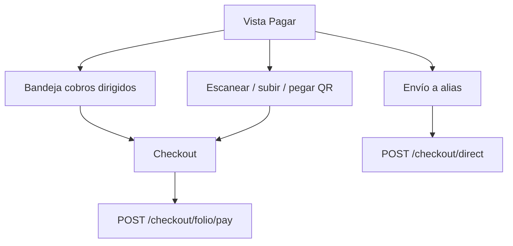

---

## 14. Notificaciones y favoritos

### 14.1 Orígenes de notificación

`auth` · `billing` · `checkout` · `membership` · `kyc` · `vault`

### 14.2 Tipos relevantes

| Kind | Cuándo |
|------|--------|
| `CHARGE_CREATED` / `CHARGE_REQUEST_RECEIVED` | Cobro nuevo / dirigido |
| `PAYMENT_RECEIVED` / `PAYMENT_SENT` | Liquidación QR |
| `DIRECT_PAYMENT_*` | Pago directo |
| `MEMBERSHIP_RECHARGE` / `MEMBERSHIP_BLOCKED` | Saldo membresía |
| `VAULT_ACCOUNT_ADDED` | Alta CLABE |
| `KYC_UPGRADE` | Cambio de nivel |

Canal actual: **solo in-app**. Los “recordatorios WhatsApp” incrementan contador y notifican en app (sin gateway real).

### 14.3 Favoritos

- Relación N:M usuario→usuario (no a sí mismo).
- Alimentan selectores de cobro dirigido y pago directo.
- API bajo `/billing/favorites` + búsqueda `/billing/users/search`.

---

## 15. Auditoría y cumplimiento

### 15.1 Cadena de integridad

```
h₀ = SHA256( primer_evento )
hₙ = SHA256( hₙ₋₁ + timestamp|operator|action|category|ip|payload )
```

- Escritura en cada evento relevante (`audit.write_audit`).
- Verificación: `GET /compliance/audit-logs/verify`.
- Retención declarada: ≥ 6 meses (SPEI) y 1 año (Canales Electrónicos).

### 15.2 Conciliación / CEP

- Cada transacción expone vínculo tipo:  
  `https://www.banxico.org.mx/cep/check?folio={clave}`
- Endpoint de conciliación del receptor: `/compliance/reconciliation`.

### 15.3 Categorías de auditoría

`auth` · `kyc_change` · `vault_access` · `payment_initiation` · `membership` · `general`

---

## 16. Despliegue y operación

### 16.1 Modos

| Modo | Cómo | Puerto |
|------|------|--------|
| PM2 dev (actual host) | `ecosystem.config.js` → uvicorn | **3017** |
| Docker dev | `docker-compose.yml` | API **8000** |
| Docker prod | `docker-compose.prod.yml` + Nginx | **80/443** |
| Host-nginx | `docker-compose.host.yml` | **3017→8000** |

### 16.2 Variables de entorno críticas

| Variable | Uso |
|----------|-----|
| `DATABASE_URL` | Postgres o SQLite |
| `AES_SECRET_KEY` | Cifrado bóveda / PII |
| `JWT_SECRET` | Firma de sesión |
| `JWT_EXPIRE_MIN` | Default 20 |
| `POSTGRES_*` | Compose |
| `REDIS_URL` | Reservado (aún sin uso app) |

### 16.3 Operación diaria sugerida

1. Health: `GET /api/health`
2. Logs PM2/Docker
3. Backup Postgres (`make backup` en prod)
4. Verificar cadena de auditoría periódicamente
5. Revisar membresías `blocked` y topes KYC

Guía EC2: `deploy/DEPLOY-AWS-EC2.md`.

---

## 17. Datos demo y pruebas

Semilla automática si la DB no tiene usuarios (`main.py`):

| Alias | Tipo | KYC | Membresía | Notas |
|-------|------|-----|-----------|-------|
| `$@empresa.demo` | Empresa | 2 | ~$50 | CLABE BBVA demo |
| `$@juan.perez` | PF | 2 | ~$20 | — |
| `$@maria.lopez` | PF | 1 | $0 | Sin operar hasta subir nivel |

Login: **solo alias** (sin password en el estado actual).

CLABE demo válida mod-10: `012180001234567895`.

---

## 18. Estado actual vs producción Banxico

| Componente | Estado actual | Producción objetivo |
|------------|---------------|---------------------|
| Mensaje de Cobro / QR | Generado en app (Apéndice AD simplificado) | Homologado con banco patrocinador |
| Liquidación SPEI/CoDi | **Simulada** en API | Riel Banxico vía PSPI |
| Clave de rastreo / CEP | Sintética + URL plantilla | Confirmación Banxico real |
| Recarga membresía | Crédito simulado | SPEI a concentradora / medio de pago |
| KYC documental | Guarda campos; `PENDING_VALIDATION` | RENAPO / INE / e.firma / biometría |
| Validación de CLABE | Mod-10 + alta inmediata | Verificación de titularidad bancaria |
| Recordatorios WhatsApp | Contador in-app | BSP / WhatsApp Business API |
| Auth password | No | Password + 2FA obligatorio |
| Redis | Contenedor sin uso | Rate-limit / sesiones |
| HSM/KMS | Clave en env | Custodia de llaves AES/JWT |
| Regla 74a | Pendiente | Auditoría externa |

---

## 19. Glosario

| Término | Significado |
|---------|-------------|
| **PSPI** | Proveedor de Servicios de Participación Indirecta en SPEI |
| **CoDi** | Cobro Digital Banxico (mensajes de cobro + liquidación) |
| **SPEI** | Sistema de Pagos Electrónicos Interbancarios |
| **Dimo** | Dinero Móvil (asociación celular–cuenta) |
| **CEP** | Comprobante Electrónico de Pago Banxico |
| **CLABE** | Clave Bancaria Estandarizada (18 dígitos) |
| **IFPE** | Institución de Fondos de Pago Electrónico (custodia) |
| **Sin captación** | La app no recibe ni guarda dinero del público |
| **Bóveda** | Almacén cifrado de cuentas destino |
| **Membresía** | Saldo prepago para tarifa de software |
| **Abono** | Crédito recibido (cuenta como payee) |
| **OPEN / TARGETED** | Cobro abierto vs dirigido a un alias |
| **Folio CoDi** | Identificador único del mensaje de cobro |

---

## 20. Referencias normativas

| Documento | Uso en el sistema |
|-----------|-------------------|
| Circular 14/2017 Banxico (SPEI) | Reglas 58a, 71a, 72a; Apéndices AN, E, O |
| Circular 12/2019 Banxico (CoDi) | Mensajes de cobro; Apéndice AD |
| Circular 9/2026 | Homologación UX; sesión 20 min |
| Art. 115 LIC (referencia) | Niveles / topes de abonos |
| Ley Fintech / LTOSF | Exclusión IFPE por no-custodia |
| Manual de operación SPEI §6 | Dígito verificador CLABE |

---

## Anexos

### A. Mapa mental del producto

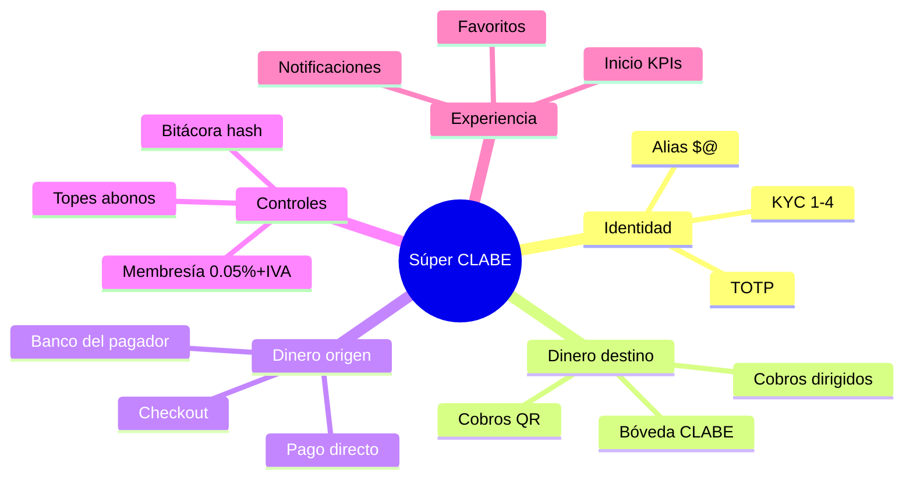

### B. Checklist de puesta en marcha (operación)

- [ ] Variables `DATABASE_URL`, `AES_SECRET_KEY`, `JWT_SECRET` definidas
- [ ] Migraciones aplicadas
- [ ] Health OK
- [ ] Usuario demo o primer admin registrado
- [ ] Al menos una CLABE en bóveda
- [ ] Membresía con saldo > 0
- [ ] KYC ≥ 2 para operar
- [ ] Probar: crear cobro → pagar → ver CEP/bitácora
- [ ] Verificar cadena de auditoría
- [ ] Backup de base de datos configurado

### C. Documentos relacionados

| Documento | Ruta |
|-----------|------|
| **Word presentable** (portada, logo, índice, paginación) | `docs/DOCUMENTACION-SISTEMA-COMPLETA.docx` |
| Descarga vía web (si el frontend está montado) | `/docs/DOCUMENTACION-SISTEMA-COMPLETA.docx` |
| Generador del Word | `docs/generate_docx.py` |
| Doc técnica v1 (histórica) | `docs/DOCUMENTACION-TECNICA.md` |
| Deploy AWS EC2 | `deploy/DEPLOY-AWS-EC2.md` |
| README proyecto | `README.md` |
| OpenAPI vivo | `http(s)://<host>/docs` |

---

*Fin del documento — Súper CLABE v2.0 · Agosto 2026*
